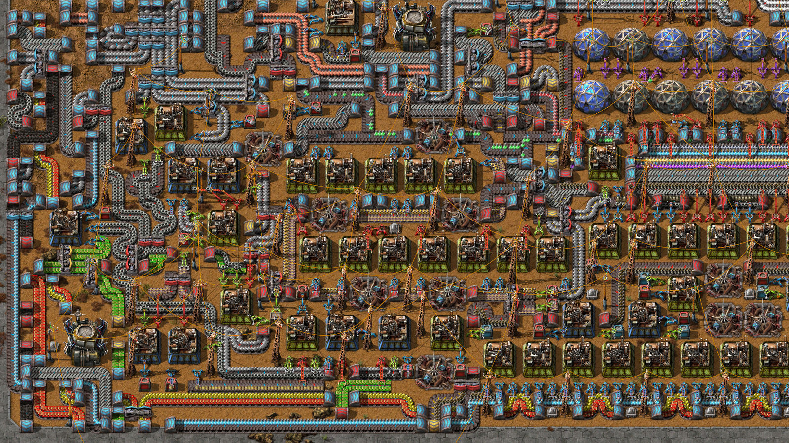

# My code, courses, examples and reminders

## My other stuff

#### Personal homepage on GitHub Pages

> https://github.com/voronokKita/voronokKita.github.io

#### Project on Django with different apps

> django + SQLite  
> https://github.com/voronokKita/alpaca-chan

#### Telegram bot that can keep track of web feeds

> pyTelegramBotAPI + SQLite + SQLAlchemy  
> https://github.com/voronokKita/kaban-chan

#### Automatic installation of mods in some Paradox Interactive games

> https://github.com/voronokKita/modstothepeople

#### Forum on Flask

> Flask + Flask-SQLAlchemy + SQLite  
> https://github.com/voronokKita/howtoforum
